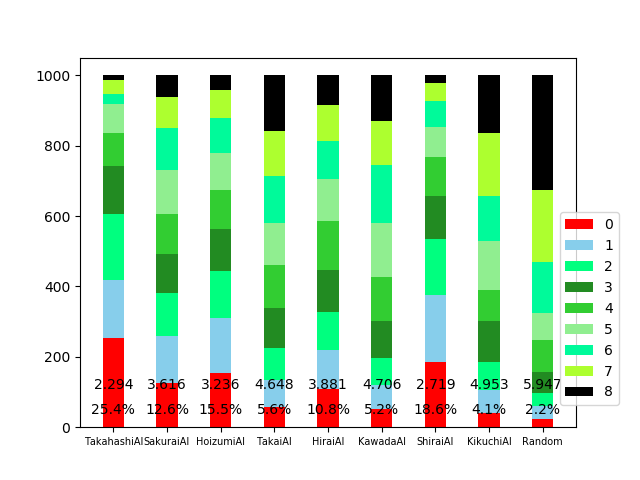
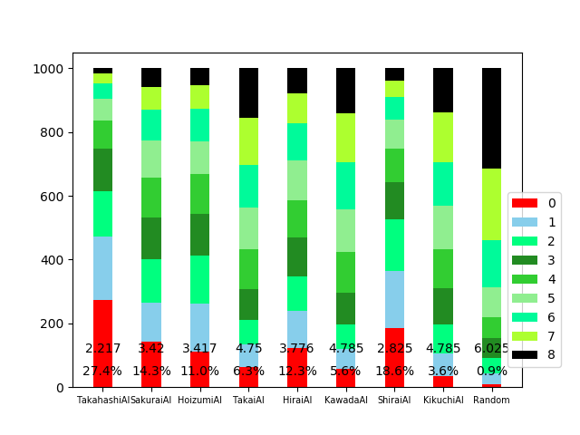
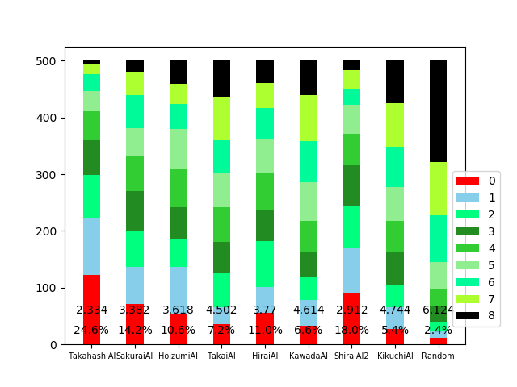
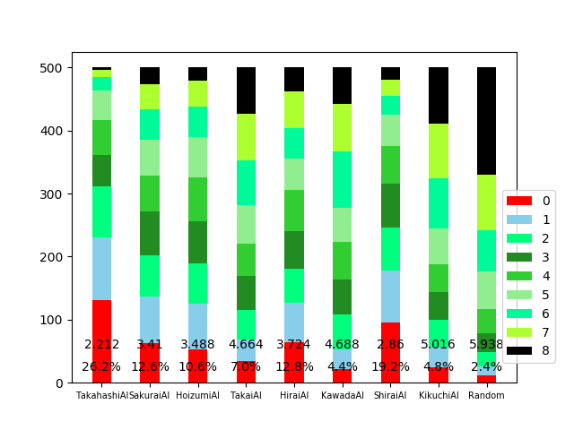

#01,はじめてのパラメータ最適化学習(parameter optimization)
最適化するのは勝率か平均順位かという問題がありますが，まずは勝率を最適化していきます．まだ準備段階ですが，計算には2,30hくらいかかります．勝率計算には少なくとも100回は回す必要があると思われ，それに1hほどかかるためです．

##最適化の方法
この最適化学習は，一言で表現すれば『自動化』です．パラメータを少しずつ動かし，その度に`100回`ゲームして勝率を計算し，`5%`以上勝率が上がった場合はそれを採用していくというものです．ここで`100回`，`5%`というのはハイパーパラメータで，現在は経験から決定しています．近い内にきちんと統計を取る必要があります．

##最適化するアルゴリズム
`nimmt_Shirai.py`のパラメータを最適化します．パラメータ数は10個で，それぞれ以下の役目を担っています．
1,初期値低評価の基準(70,0.5,0.1,0.5)
カードの評価値が同じ際の選択として，私は評価リストに初期値を入れることでその選択をさせています．現在は基本的に大きい方を選択するような初期値[0,1,2,...]を入れていますが，この初期値設定には弱点があり，ゲーム後半に小さい数字のカードが偏る，すなわちカードの多様性が徐々に小さくなっていくという欠点があります．そこで，ゲーム後半に備えて大きいカードを保持するために，ある大きさ以上のカードの初期値をやや低評価にしています．
カード番号`70`以上かつリストの`50%`以上に位置するカードに`0．1`を，それ以外に`0．5`を比例係数として，乗じています(例：[0,0.5,1.0,...,0.6,0.7,...])．
2,定数型危険察知(5,7)
フィールドのカードから，6枚目になりそうなカードを察知するものです．現在は，Lを列のカード枚数として，`5`*(6-L)+-`7`のカードが危険であるとしています．単純な経験則ですが，これによって私のAIは上位に入り込めたという，強力で思い出深い危険察知です．しかしアルゴリズムが複雑化するにつれて仇となる場合もまま出てきました．
3,変数型危険察知(2,0)
フィールドに出されたカードを記憶することで，残りのカードを知ることが出来ます，これを用いた危険察知です．自分のカードと，置こうとする列の末端の間にあるカード枚数をCとし，-C/`2`+`0`という低評価を課すのが現在の設定です．つまり，間のカード枚数が増えるほどに低評価が重くなるという仕様です．しかし間のカードの枚数が増えると悪いのではなく，6枚目になりそうなカードが悪いので，現在の低評価は理に適ってはいないと思います．しかし私の調査ではこれが最も成果が上がりました．
4,戦略的自滅(-6,4)
列末端の最小値よりも小さいカードを出さず，5枚ある列の最小値よりも大きいカードは出さない．これは自滅を防ぐアルゴリズムですが，良いカードが全くなく，小さいカードが残っており，なおかつ列の牛の数が小さい時は後のために自滅を図ったほうが有利になるときもあります．これが戦略的自滅です．現在は最大評価値が`-6`以下，最小牛数が`4`以下の時に戦略的自滅を図ります．評価関数はアルゴリズムを変える度に変化していくので，戦略的自滅の基準の設定は非常に難しく感じます．

最適化前の結果は以下です．


#結果1
```csv:opt01.csv
para_list:,[70, 0.5, 0.1, 0.5, 5.0, 7.0, 2.0, 0.0, -6.0, 4]
13.0
para_list:,[75, 0.5, 0.1, 0.5, 5.0, 7.0, 2.0, 0.0, -6.0, 4]
21.0
para_list:,[80, 0.5, 0.1, 0.5, 5.0, 7.0, 2.0, 0.0, -6.0, 4]
21.0
para_list:,[75, 0.6, 0.1, 0.5, 5.0, 7.0, 2.0, 0.0, -6.0, 4]
10.0
para_list:,[75, 0.39999999999999997, 0.1, 0.5, 5.0, 7.0, 2.0, 0.0, -6.0, 4]
20.0
para_list:,[75, 0.5, 0.2, 0.5, 5.0, 7.0, 2.0, 0.0, -6.0, 4]
22.0
para_list:,[75, 0.5, 0.0, 0.5, 5.0, 7.0, 2.0, 0.0, -6.0, 4]
26.0
para_list:,[75, 0.5, -0.1, 0.5, 5.0, 7.0, 2.0, 0.0, -6.0, 4]
19.0
para_list:,[75, 0.5, 0.0, 0.6, 5.0, 7.0, 2.0, 0.0, -6.0, 4]
16.0
para_list:,[75, 0.5, 0.0, 0.39999999999999997, 5.0, 7.0, 2.0, 0.0, -6.0, 4]
20.0
para_list:,[75, 0.5, 0.0, 0.5, 6.0, 7.0, 2.0, 0.0, -6.0, 4]
28.0
para_list:,[75, 0.5, 0.0, 0.5, 4.0, 7.0, 2.0, 0.0, -6.0, 4]
17.0
para_list:,[75, 0.5, 0.0, 0.5, 5.0, 8.0, 2.0, 0.0, -6.0, 4]
22.0
para_list:,[75, 0.5, 0.0, 0.5, 5.0, 6.0, 2.0, 0.0, -6.0, 4]
22.0
para_list:,[75, 0.5, 0.0, 0.5, 5.0, 7.0, 2.5, 0.0, -6.0, 4]
24.0
para_list:,[75, 0.5, 0.0, 0.5, 5.0, 7.0, 1.5, 0.0, -6.0, 4]
15.0
para_list:,[75, 0.5, 0.0, 0.5, 5.0, 7.0, 2.0, 1.0, -6.0, 4]
21.0
para_list:,[75, 0.5, 0.0, 0.5, 5.0, 7.0, 2.0, -1.0, -6.0, 4]
15.0
para_list:,[75, 0.5, 0.0, 0.5, 5.0, 7.0, 2.0, 0.0, -5.0, 4]
14.0
para_list:,[75, 0.5, 0.0, 0.5, 5.0, 7.0, 2.0, 0.0, -7.0, 4]
21.0
para_list:,[75, 0.5, 0.0, 0.5, 5.0, 7.0, 2.0, 0.0, -6.0, 5]
23.0
para_list:,[75, 0.5, 0.0, 0.5, 5.0, 7.0, 2.0, 0.0, -6.0, 3]
21.0
```
28%:[75, 0.5, 0.0, 0.5, 6.0, 7.0, 2.0, 0.0, -6.0, 4]が気になったので，そのパラメータで1000回回したところ，次のようになりました．最悪です．

学習結果26%:[75, 0.5, 0.0, 0.5, 5.0, 7.0, 2.0, 0.0, -6.0, 4]を500回まわしたら次のようになりました


#発覚した問題点
･1位は1位ではない
同得点の時，プレイヤーナンバーの若いほうが順位が低くなるというのが現在のニムトAIの仕様のようです．よってプレイヤーナンバーを大きくするほど，順位が小さめに出てしまいます．よって学習時には，AIをプレーヤー1にセットする必要があります．100回回すと，3，4回はこのような状況が見られました．
･`5%`は厳しい
100回回して5%以上の成果が得られるというのは非常に厳しく，ほとんどありません．学習の様子を見ていると，2%が妥当に思えました．

以上を踏まえて再測定をします．ついでに以下のパラメータも最適化します．
5,戦略的自滅の基準
間にあるカードの枚数をC，残りのカード枚数をRとして，C<=R/`10`+`0`の時に戦略的自滅を図るとします．

#結果2
```opt02.csv
para_list:,[7.0, 2.0, 0.0, -6.0, 4, 10, 0]
19.0
para_list:,[8.0, 2.0, 0.0, -6.0, 4, 10, 0]
20.0
para_list:,[6.0, 2.0, 0.0, -6.0, 4, 10, 0]
26.0
para_list:,[5.0, 2.0, 0.0, -6.0, 4, 10, 0]
19.0
para_list:,[6.0, 2.1, 0.0, -6.0, 4, 10, 0]
16.0
para_list:,[6.0, 1.9000000000000001, 0.0, -6.0, 4, 10, 0]
23.0
para_list:,[6.0, 2.0, 1.0, -6.0, 4, 10, 0]
23.0
para_list:,[6.0, 2.0, -1.0, -6.0, 4, 10, 0]
11.0
para_list:,[6.0, 2.0, 0.0, -5.0, 4, 10, 0]
20.0
para_list:,[6.0, 2.0, 0.0, -7.0, 4, 10, 0]
21.0
para_list:,[6.0, 2.0, 0.0, -6.0, 5, 10, 0]
24.0
para_list:,[6.0, 2.0, 0.0, -6.0, 3, 10, 0]
20.0
para_list:,[6.0, 2.0, 0.0, -6.0, 4, 10.5, 0]
14.0
para_list:,[6.0, 2.0, 0.0, -6.0, 4, 9.5, 0]
20.0
para_list:,[6.0, 2.0, 0.0, -6.0, 4, 10.0, 1]
21.0
para_list:,[6.0, 2.0, 0.0, -6.0, 4, 10.0, -1]
21.0
```
26%:[6.0, 2.0, 0.0, -6.0, 4, 10, 0]で500回回すと次のようになりました．


以上，学習によって多少の成果が見られました（500回が本当に信用できるかは今後考察します）が，計算に30時間かける価値があったのかは微妙なところです．

#今後の課題として
･ニムトの統計
まずはハイパーパラメータの設定のために，ニムトの統計をとらなくてはなりません．ゲーム回数を何回すれば，どれくらいのバラツキが生じるのかを調べます．また，現在のルールではゲーム終了は牛の数が66になった時ですが，これを減らすと統計に影響は出るのかも調べる必要があります．ここを減らすことに成功すれば，計算量を約1/3に減らすことができ，学習の高速化が図れます．
･勝率最適化は妥当か
勝率は1位になった時にしか注目しません．しかし順位という情報はあまりに淡白です．勝率が低くても平均順位は高いということはよくあります．また同じ1位でも，2位と1点差なのか，0点で1位なのかも少々異なるように思います．さらに，順位は数点で変化する不安定なものです．学習においては勝率よりも点数を重視したほうが良いのかもしれません．
・強化学習へ
今回やったのは，機械学習というよりは，パラメータ調整の自動化です．将来的には，場のカードと自分のカードから最適な出し方を学習させることができれば理想です．

